# DumDum Maths — screens

What the app actually renders, next to the drawing it was built to.

Public on purpose: these are the pictures used to review the build. They
contain **no personal data** — no child's real name, no account, no
address, no analytics. Every screen here is a fixed example chosen for
the test.

The app itself is at **[app.dumdummaths.com](https://app.dumdummaths.com)**.

## How to read the difference images

**Yellow is antialiasing. Red is a real difference.** The comparison is
Playwright's `toHaveScreenshot` at 1024x768, threshold 0.03, where the
*expected* image is the mockup itself rather than a snapshot of the app —
a screenshot test that compares an app to a picture of that same app
always passes; these can fail.

The mockup PNGs are rendered by the same browser and the same font files
the app uses, so what is left is genuinely sub-pixel: a curve or a glyph
edge landing half a pixel differently.

| screen | difference | of 786,432 pixels |
|---|---|---|
| 01 — a question | **615** | 0.078% |
| 02 — one miss later | **1,255** | 0.160% |
| 03 — who's playing | **386** | 0.049% |
| 04 — finished for today | **181** | 0.023% |

---

## Why the answer cards sit where they do

The answer row used to clear the 115px band where a child rests a wrist
by **1.5px** — a coincidence, not a margin — and answers commit the
moment a finger lands. On a real iPad in Safari, where the toolbar
leaves 1024x694, that put the cards *inside* the band.

The lower half of 01 and 02 is lifted 14px, which is as far as it can go
before 02's three-line bubble is in the way. It now clears by 15px at
the drawn size and 3px on a real iPad. A 1024x600 tablet is still
inside, and fixing that means redrawing the composition rather than
nudging it.

## 01 — the Year 2 question screen

The Infant frame: DumDum bottom-left, the question in his speech bubble,
one card in the middle holding the apparatus, the answers along the
bottom, and the garden underneath so the child can see what they are
growing. **8 add 5**, eight counters in the ten frame and five loose.

| the drawing | the build | the difference |
|---|---|---|
|  | 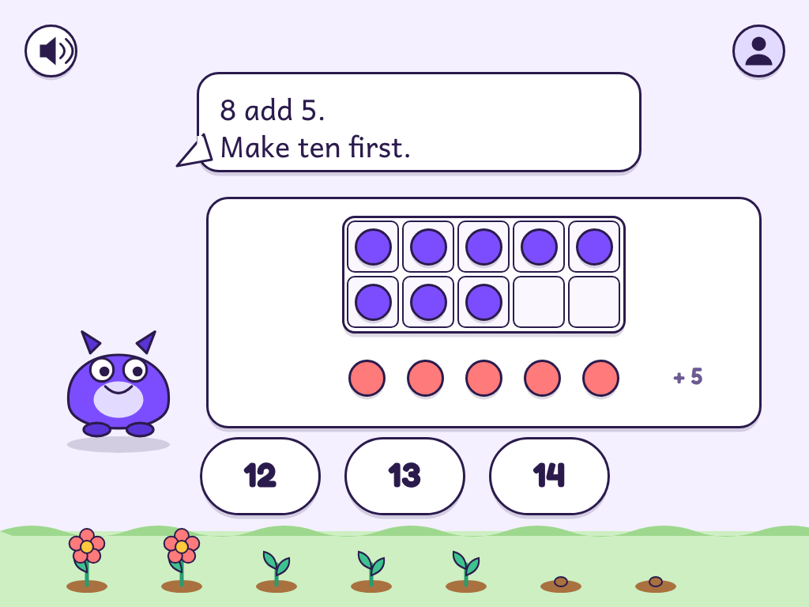 | 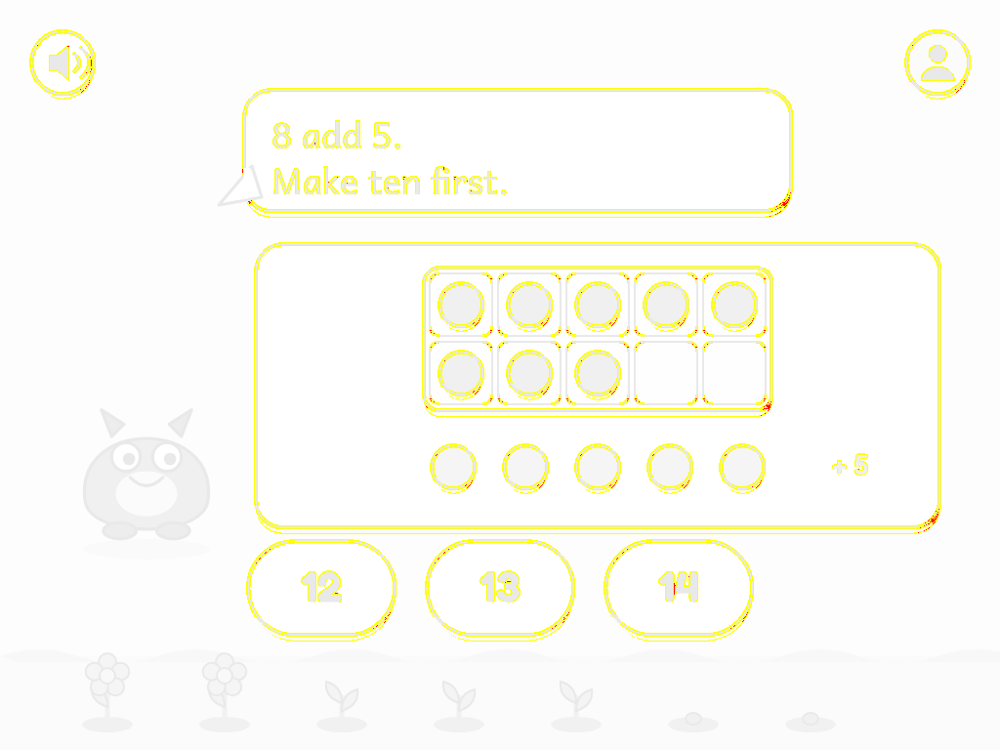 |

## 02 — the same question, one miss later

The card they pressed lights **sun, never red, and there is no cross**.
Two counters lift and dashed paths run into the two empty cells.

Nothing on this screen holds the number two: the engine decides that a
second miss shows the working, and the ten frame works out that the gap
to ten is 10 minus 8.

| the drawing | the build | the difference |
|---|---|---|
| 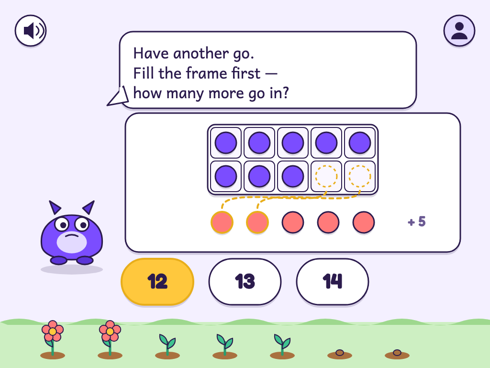 | 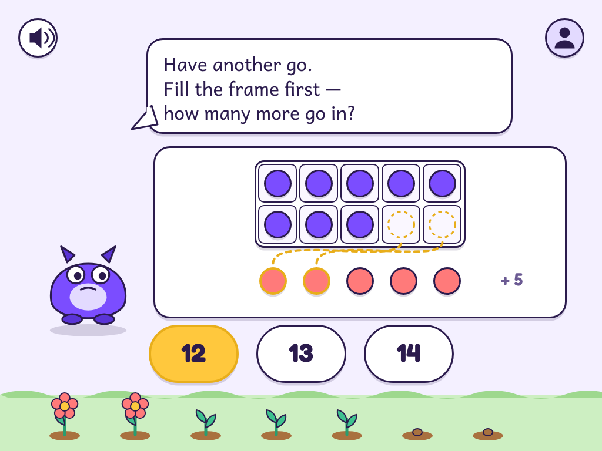 | 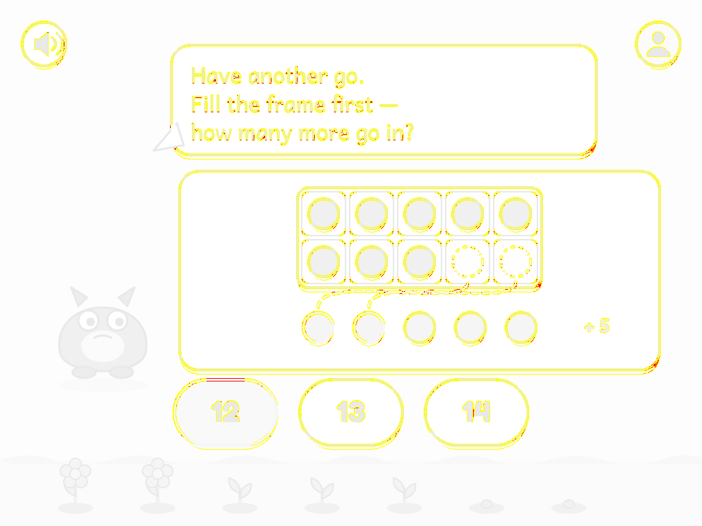 |

## 03 — who's playing

One big card per child: a face to recognise before you can read the
name. The faces are art slots — a coloured disc until real avatars
exist. It has a speaker now: the drawing had none, which made it the one
child screen where a child who cannot read had no way to hear the
question.

| the drawing | the build | the difference |
|---|---|---|
| 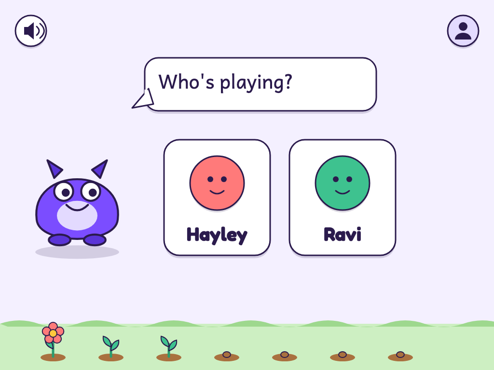 | 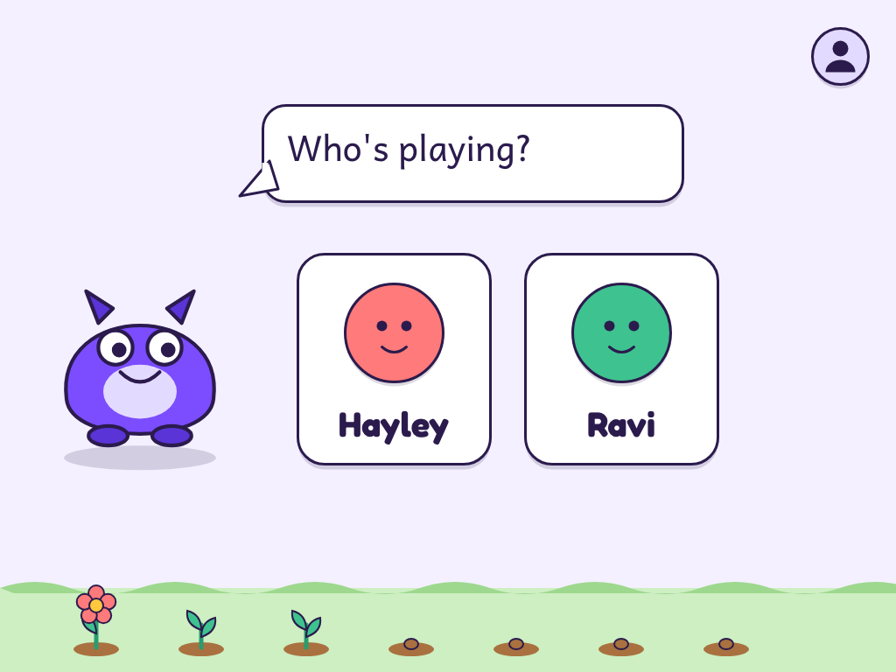 | 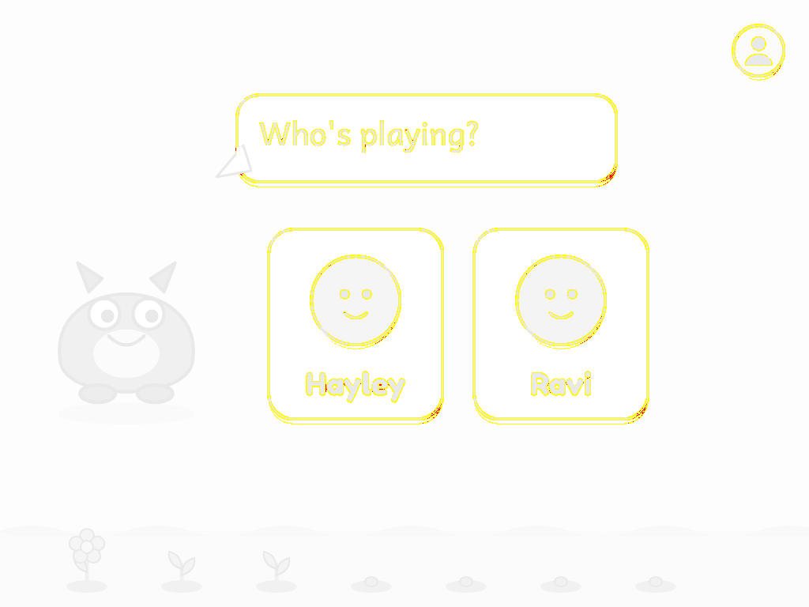 |

## 04 — finished for today

The garden fills the bottom of the screen, because it is the whole
reward: what grew is what they did. No score, no stars, no "7 out of
10". One way out, and it is a leaf.

| the drawing | the build | the difference |
|---|---|---|
| 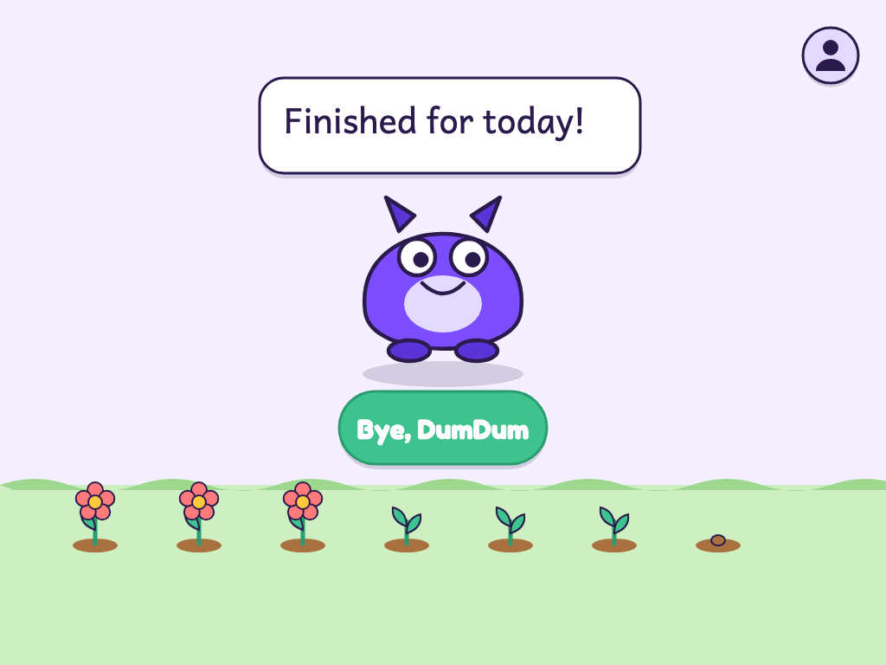 | 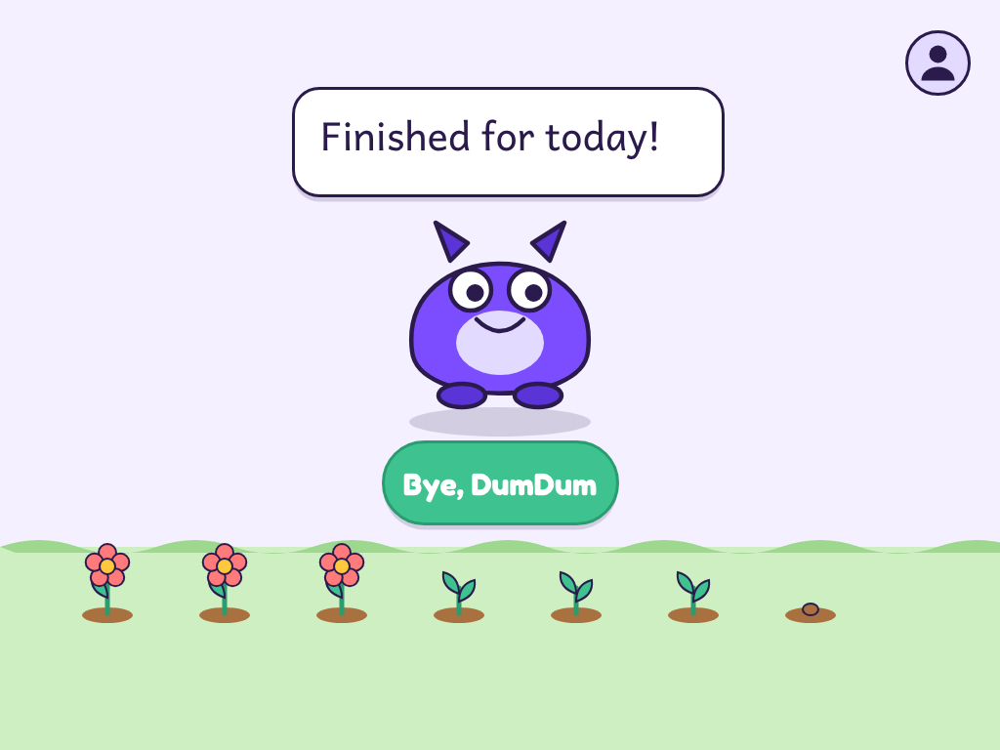 | 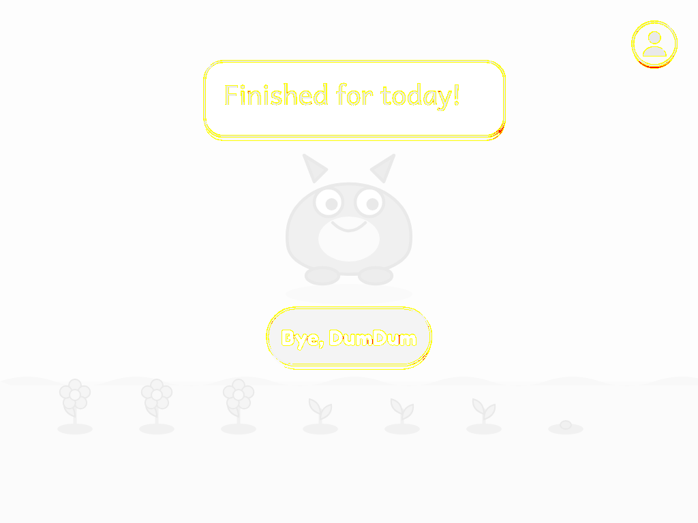 |

---

## Held the wrong way up, or on a phone

A child screen is landscape. Rather than squeeze the drawing into a
shape nobody drew — which put every target at 50px in portrait and 26px
on a phone, against a 64px floor — the product shows a screen made for
the shape it is in.

The portrait one has **no words at all**: a Year 1 child may not read
yet, so DumDum turning inside an arrow is the whole message, and
"Turn me round!" is spoken.

| portrait on a tablet | on a phone |
|---|---|
| 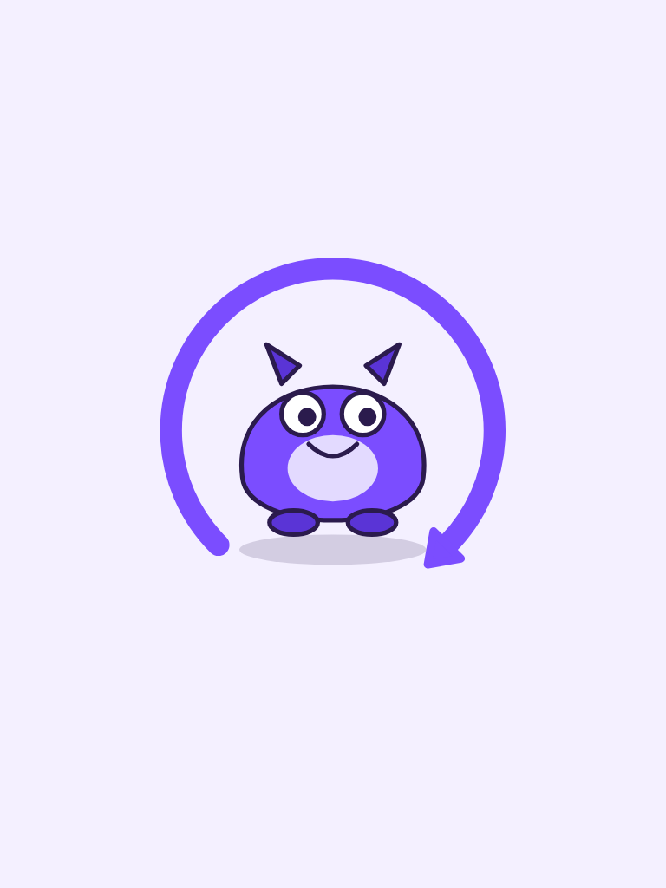 | 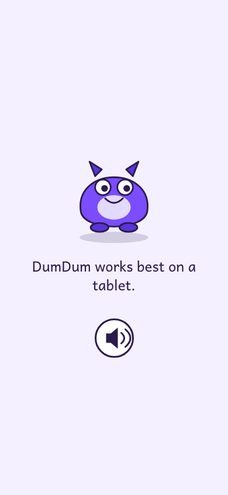 |
